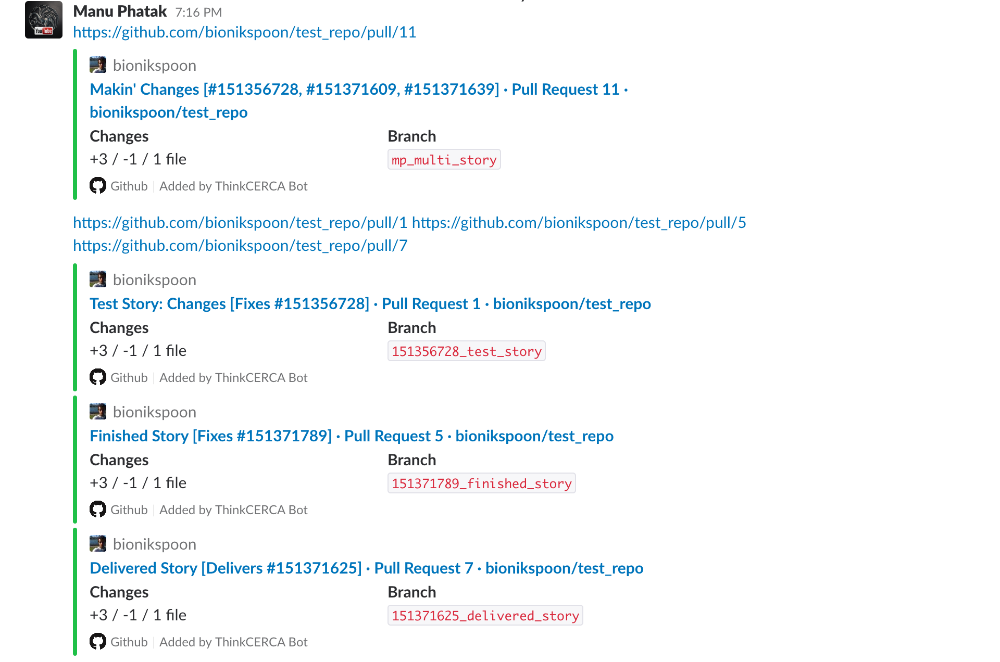
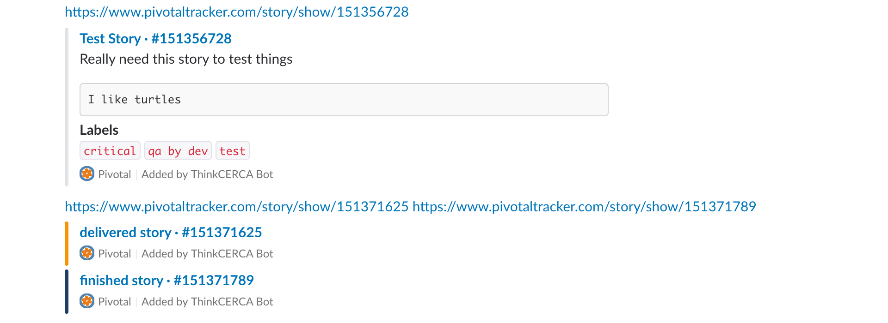

# TC Slack Bot

## Problem

As slack user, links to private resources (Github, Pivotal) are a click away from being useful.

For example: Let's say someone links `https://github.com/bionikspoon/test_repo/pull/11` or `https://www.pivotaltracker.com/n/projects/2113469/stories/151356728`. That person is going to also copy and paste some related information so everyone in the room has some conversational context. This process can be automated!

## Solution

Enter TC Slack Bot!

In slack's lingo, this bot `unfurls` urls. Unfurling is the process of getting meta data from url and showing a pretty card. Since some resources are behind a auth walls, Slack's default unfurling doesn't work. This bot intercepts interesting urls and handles the unfurling.

## Architecture Summary

This bot is a webhook server subscribed to slack's `link_shared` event.

Upon retrieving a shared link it queues an [UnfurlLinkJob](./app/jobs/unfurl_link_job.rb) job. This job fetches the linked resource using public apis with proper auth headers and publishes the results to slack's api.

I was interested in playing with [trailblazer.to](trailblazer.to). Most everything is happening trailblazer pipes.

## Screen Shots

